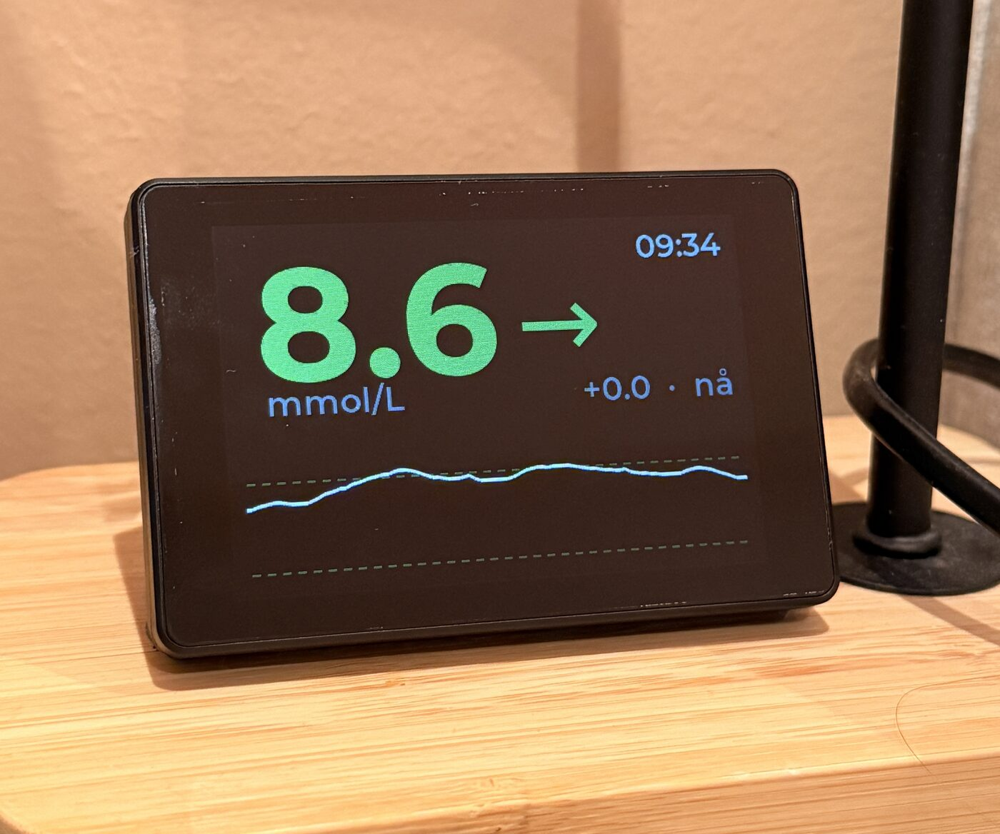

# BS-Buddy

A tiny always-on screen that shows your Nightscout blood sugar in big, colour-coded
digits you can read from across the room.

It runs on cheap, off-the-shelf ESP32 display modules. I built it for the one I
have (the **Guition JC3248W535**, a 3.5″ touch screen), but it's set up so other
ESP32 screens can be added too. See [Supported boards](#supported-boards).

> ⚠️ **Not a medical device.** It's for convenience only. Never make treatment
> decisions from it; always check your CGM/receiver or a meter.

<p align="center">
  
</p>

## What it shows

- The current value, **big and colour-coded** (red / yellow / green / orange by zone)
- A **trend arrow** for which way it's heading
- The **change** since the last reading (`+0.3`) and **how long ago** it was
- A **sparkline** of recent readings, with dashed lines marking your low/high targets
- A **clock**, plus an `ingen nett` warning if the connection drops
- **Tap the screen** to dim or turn off the backlight

It also fades the value when a reading goes stale, reconnects WiFi on its own, and
uses polled touch so it doesn't depend on a flaky interrupt pin.

The on-screen text is **Norwegian** by default (`nå`, `min siden`, `ingen nett`) and
lives in one file — easy to change; see [Configuration](#configuration).

## Quick start

1. **Install [PlatformIO Core](https://docs.platformio.org/en/latest/core/installation/)**
   (or the VS Code extension).

2. **Clone & configure credentials:**
   ```bash
   git clone https://github.com/Medpus/bs-buddy-esp32.git
   cd bs-buddy-esp32
   cp include/secrets.example.h include/secrets.h
   $EDITOR include/secrets.h        # WiFi + Nightscout URL + token
   ```
   `secrets.h` is git-ignored. To read a locked-down Nightscout site you need a
   **read-only token**; see [`docs/NIGHTSCOUT.md`](docs/NIGHTSCOUT.md).

3. **Build & flash:**
   ```bash
   pio run -t upload      # build + flash over USB (default board: jc3248w535)
   pio device monitor     # watch the serial log @ 115200
   ```
   `pio run` targets the default board; pass `-e <board>` to pick another (each
   board has its own env; see [Supported boards](#supported-boards)).

That's it. On boot the screen shows progress (WiFi → time sync → fetching), then
your glucose. Full flashing details, the ESP32-S3 BOOT/RST procedure, and Linux
serial-permission setup are in [`docs/FLASHING.md`](docs/FLASHING.md).

## Configuration

- **Credentials** → `include/secrets.h` (`WIFI_SSID`, `WIFI_PASS`, `NS_URL`, `NS_TOKEN`)
- **App settings** → [`src/core/config.h`](src/core/config.h): thresholds (mmol), poll
  interval, stale timeout, brightness levels, sparkline length, timezone.
- **Board geometry** (resolution/rotation/pins) → the active board's header,
  e.g. [`src/board/jc3248w535/pins.h`](src/board/jc3248w535/pins.h).
- **On-screen text** → [`src/core/strings.h`](src/core/strings.h): every word the
  display shows. **Norwegian by default** (`nå`, `min siden`, `ingen nett`, …) —
  change it to whatever language you like.

Default glucose thresholds (mmol/L): urgent-low `3.0`, low `3.9`, high `10.0`,
urgent-high `13.3`. Edit `src/core/config.h` to taste.

## Supported boards

| Board | Display / Touch | Tested? |
|---|---|---|
| **Guition JC3248W535** | 3.5″ 320×480, AXS15231B QSPI + touch | ✅ yes, it's the one I have |

The reference board is an all-in-one module — no wiring, just USB-C. Full pin map
and specs (MCU, PSRAM, touch) are in [`docs/HARDWARE.md`](docs/HARDWARE.md).

Got a different ESP32 screen? Adding it is mostly self-contained: a new
`src/board/<name>/` folder plus a build env, with no changes to the rest. The
walkthrough is in [`docs/ADDING_A_BOARD.md`](docs/ADDING_A_BOARD.md). PRs welcome.
Just say whether you've actually run it on the hardware, so the table stays honest.

## Project layout

```
platformio.ini           shared [env] + one [env:<board>] per board
boards/jc3248w535.json    PlatformIO board JSON (flash / OCTAL PSRAM / partitions)
include/lv_conf.h         LVGL 9 configuration
include/secrets.h         your credentials (git-ignored; copied from secrets.example.h)
src/
  main.cpp               thin entry: init HAL → view → app, then loop
  core/                  device-INDEPENDENT backend
    app.cpp              poll scheduling; builds the ViewModel
    nightscout.cpp       HTTPS fetch + JSON parse + NTP
    net.cpp              WiFi connect / reconnect
    glucose.h            units, zones, trend mapping
    viewmodel.h          backend → view contract
    config.h             app settings (thresholds, timing, brightness, …)
    strings.h            on-screen text (Norwegian by default; translate here)
  view/                  LVGL presentation (reads a ViewModel)
    ui.cpp               screen (value / arrow / delta / age / sparkline)
    fonts/               pre-generated LVGL fonts (.c)
  hal/                   the contract each board implements (display/touch/board.h)
  board/                 one directory per board (the only place a board adds code)
    jc3248w535/          reference: QSPI panel + I²C touch + pins + metadata
    _template/           skeleton to copy for a new board
scripts/gen_fonts.sh     regenerate the fonts (needs Node + the .otf/.ttf)
docs/                    HARDWARE / FLASHING / NIGHTSCOUT / ADDING_A_BOARD
```

## Credits

- Nightscout data model & trend logic informed by
  [ireneusz-ptak/ns-thingy](https://github.com/ireneusz-ptak/ns-thingy).
- JC3248W535 display/touch bring-up cross-referenced from
  [byte-me404/JC3248W535_lvgl_test](https://github.com/byte-me404/JC3248W535_lvgl_test),
  [NorthernMan54/JC3248W535EN](https://github.com/NorthernMan54/JC3248W535EN) and
  [me-processware/JC3248W535-Driver](https://github.com/me-processware/JC3248W535-Driver).
- Inspiration: [SugarPixel](https://customtypeone.com/collections/sugarpixel),
  [SugarDash](https://mysugardash.com/).
- Libraries: [Arduino_GFX](https://github.com/moononournation/Arduino_GFX),
  [LVGL](https://lvgl.io), [ArduinoJson](https://arduinojson.org).

## License

[MIT](LICENSE).
